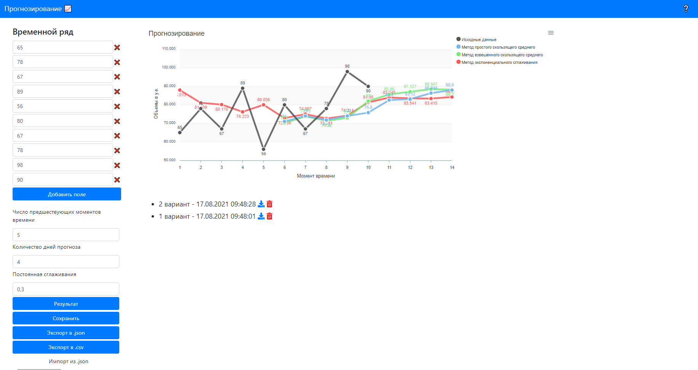
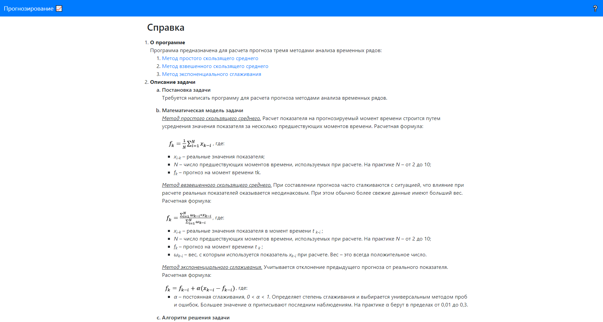

<!-- Иконка -->
 

  

  <h3 align="center">Прогнозирование</h3>

  

    Прогнозирование временных рядов методами простого скользящего среднего, взвешенного скользящего среднего и экспоненциального сглаживания.
     
  

<!-- О проекте-->
## О проекте

Программа предназначена для расчета прогноза тремя методами анализа временных рядов:
1. Метод простого скользящего среднего
2. Метод взвешенного скользящего среднего
3. Метод экспоненциального сглаживания

В справке содержится описание каждого метода и алгоритм расчета.
Можно сохранить пресет с данными в локальное хранилище, а также экспортировать содержимое локального хранилища на компьютер или восстановить.

### Создано с помощью
* [Bootstrap](https://getbootstrap.com)
* [Vue.js](https://vuejs.org)
* [ApexCharts.js](https://apexcharts.com)
